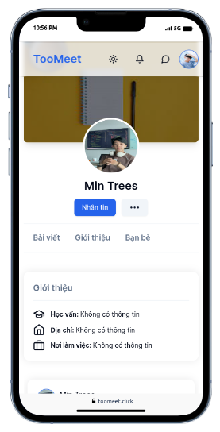

# Introduction
Welcome to the Student Social Network application designed specifically for students of Thu Dau Mot University. The primary aim of this application is to create a platform where students can connect, build relationships, and share career opportunities in a vibrant and interactive environment.

# Microservices Architecture

## Overview

This application is built upon a microservices architecture, designed to facilitate interactions among students of Thu Dau Mot University in a dynamic social environment focused on networking and career opportunities.

## Core Services
### 1. Api Gateway
Responsibilities: Balances load, handles user authentication and authorization, enforces rate limits, and routes users to respective services.
Integration: Interfaces with User service for user authorization, appending custom headers to requests before forwarding them to corresponding services.

### 2. User Service
Responsibilities: Manages user data and authentication and handles user permissions and roles.

### 3. Post Service
Responsibilities: Manages post creation and interactions, including likes, shares, and comments.

### 4. Message Service
Responsibilities: Manages real-time messaging functionalities, supporting both personal and group chats.

### 5. Group Service
Responsibilities: Facilitates community creation and management, allowing users to form and administer groups with specialized content.

### 6. Socket Service
Responsibilities: Manages socket connections for real-time features within the application.

## Key Mechanisms

### Authentication and Authorization via Api Gateway
- Authentication: Api Gateway verifies user requests and authorizes access by interfacing with the User service.
- Custom Headers: Custom headers are added to requests before routing them to the appropriate services.

### Inter-Service Communication
- Synchronous Communication: Services call local APIs of other services synchronously, waiting for responses.
- Asynchronous Communication: Inter-service requests are handled through RabbitMQ message queues to ensure scalability and reliability.

### Data Consistency Challenges
Saga Pattern: Implemented to maintain data consistency across distributed services, ensuring transactional integrity in asynchronous communication.

## Deployment with Docker Swarm
### Container Orchestration:
Deployed using Docker Swarm, leveraging its automated network management for seamless service discovery and load balancing.
### Service Discovery:
Docker Swarm automatically manages virtual DNS entries for services, eliminating the need for a separate discovery server traditionally required for IP management and load balancing.
### Manage and monitoring (Portainer):

## Features
### 1. User Authentication and Registration
   Two-Step Verification: Users can enable two-step verification for added security, configurable within the settings.
   Login and Registration: Seamless and secure user authentication and registration process.

   

### 2. Post Creation and Interaction
   Post Creation: Users can create posts with text and images.
   Post Interaction: Like, share, and comment on posts to engage with the community.

   

### 3. Friend Management
   Friend Requests: Users can send and accept friend requests.
   Friend Recommendations: The system suggests potential friends based on user activity.
   Friend Profiles and Timelines: View information and timelines of friends and followers.

   

### 4. Messaging
   Personal Messaging: Send messages to individual users.
   Group Messaging: Create and participate in group chats.
   Messaging Features: Invite others to conversations, customize chat settings, and send images.

   

### 5. Group Creation and Management
   Community Groups: Users can create groups for specific interests or activities.
   Group Posts: Share posts within the group.
   Group Administration: Group creators act as admins, managing and approving posts within the group.
   
   

### 6. Profile Customization
   Profile Settings: Customize personal profiles to reflect individual preferences and information.

   
   

### 7. Security and Settings
   Two-Step Verification Settings: Enable and manage two-step verification for enhanced security.
   Login History: View and monitor login history for account security.
   
   
   
   